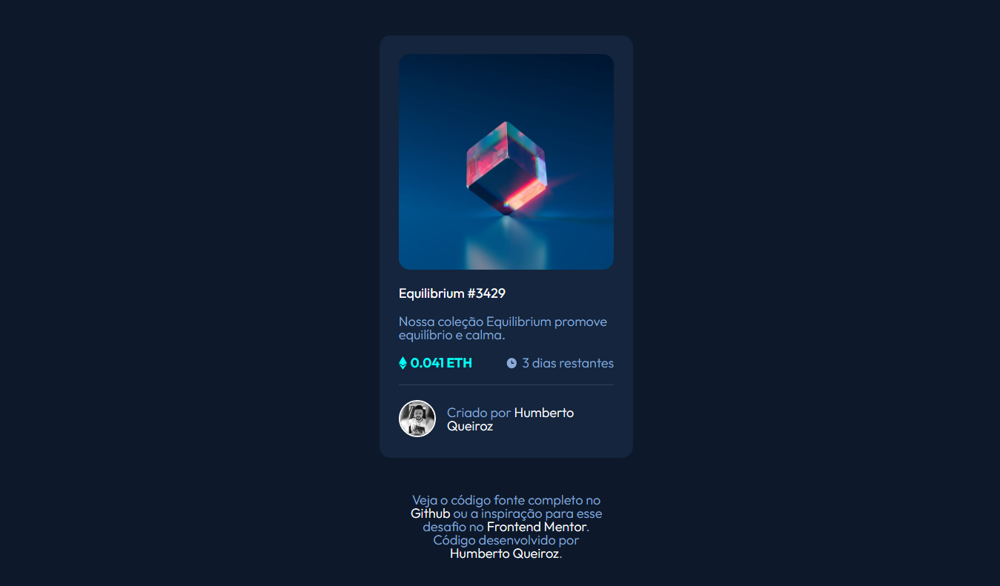
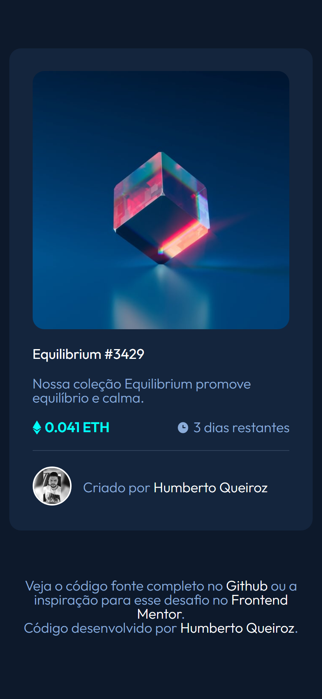

## Oi, bem-vindo! / Hi, welcome! 👋

Eu sou `Humberto Queiroz` desenvolvedor Web Front-End, estudo por conta própria programação web FrontEnd e faço o curso Técno em Análise de Desenvolvimento de Sistemas-TADS no IFMT e tenho meu próprio site hospedado no Github.

US - I'm `Humberto Queiroz` Web Front-End developer, I've been studying programming, I'm taking the Technical course in Systems Development Analysis-TADS at IFMT and I have my own website hosted on Github.

**Venha conhecer meus projetos / Come see my projects** 

Acesse meu site e conheça mais sobre mim e [projetos que já desenvolvi](https://humbertoqueiroz.github.io/).

US - Visit my website and learn more about me and the [projects I've developed](https://humbertoqueiroz.github.io/).

## O desafio / The challenge

O desafio deste projeto é copiar o designer base de forma fiel, independente do tamanho da tela do dispositivo usado.


US - The challenge of this project is to faithfully copy the base designer, regardless of the screen size of the device used.

## Resultado / Result

`Desktop`



`Smartphone`




## Responsividade / Responsiveness 📲

Todo o projeto foi desenvolvido com foco no `mobile first`, sendo totalmente responsiva em qualquer dispositivo, smartphone, tablet ou desktop. 

US - The entire project was developed with a focus on `mobile first`, being fully responsive on any device, smartphone, tablet or desktop.

## Acessibilidade / Accessibility ♿

Todas as imagens contem o atributo alt com descrição do conteúdo da imagem.

US - All images contain the alt attribute with a description of the image's content.

## HTML5 e SEO

Ulitizado `tags  semânticas e meta tags para rankeamento de SEO`, como Keywords para palavras chave, description para identificar o texto que vai aparecer no resutado da busca após o link do site, robots para indicar que deve ser indexado em buscas, canonical para definir o link canonico. 

Us - Used `semantic tags and meta tags for SEO ranking`, such as keywords, description to identify the text that will appear in the search result after the website link, robots to indicate that it should be indexed in searches, canonical to define the link canonical.

## CSS Flexbox

Neste projeto optei por utilizar o CSS "puro" por ser um projeto pequeno e com designer específico onde não seria muito proveitoso as classes já definidas de um framework como Bootstrap, utilizei **Flexbox** para responsividade e **@mediaquery** .

Utilizei a `metodologia BEM` de definição de classes. 

US - In this project I chose to use "pure" CSS because it is a small project with a specific designer where classes already defined in a framework such as Bootstrap would not be very useful, I used **Flexbox** for responsiveness and **@mediaquery** .

I used the `BEM methodology` for defining classes.

## Apendizado / Apprenticeship 

Treinei o uso de flexbox para posicionamento de elementos, estilização com o CSS.

Aprendi a mudar a propriedade de uma class quando posicionar o cursor (:hover) sobre outro elemento, utilizei para alterar a propriedade visibility, mostrando a imagem preview.

```css
.container__margin__container:hover .container__margin__container__preview{
    visibility: visible;
}
```

Também aprendi sobre a propriedade `position: absolut;`que tem dois comportamentos, dependendo do seu elemento pai, caso ele seja `static`, o posicionamento do elemento vai elevar em consideração o ponto 0 da tela, mas caso `não seja static` vai levar em consideração o ponto 0 do elemento pai para posicionamento.
  

  ```css
  .container__margin__container{
    position: relative;
}

.container__margin__container__preview{
    position: absolute;
    top: 40%;
    left: 45%;
    visibility: hidden;
}
```

US - I trained the use of flexbox for positioning elements, styling with CSS.

I learned how to change the property of a class by positioning the cursor (:hover) over another element, used to change the visibility of the property, showing a preview of the image.

```css
.container__margin__container:hover .container__margin__container__preview{
    visibility: visible;
}
```

I also learned about the `position: absolute;` property, which has two behaviors, depending on its parent element, if it is `static`, the element's positioning will take into account the point 0 of the screen, but if it is `not static` will take into account the 0 point of the parent element for positioning.
  

  ```css
  .container__margin__container{
    position: relative;
}

.container__margin__container__preview{
    position: absolute;
    higher: 40%;
    left: 45%;
    visibility: hidden;
}

```

## Github

O código fonte completo deste projeto esta disponível no [Github](https://github.com/HumbertoQueiroz/Cripto-FrontEndoMentor)

US - The complete source code of this project is available on [Github](https://github.com/HumbertoQueiroz/Cripto-FrontEndoMentor)


## Designer do desafio / Challenge designer

[Veja o designer base para esse desafio no site FrontEnd mentor:](https://www.frontendmentor.io/challenges/nft-preview-card-component-SbdUL_w0U)

US - [See the base designer for this challenge on the FrontEnd mentor site:](https://www.frontendmentor.io/challenges/nft-preview-card-component-SbdUL_w0U)